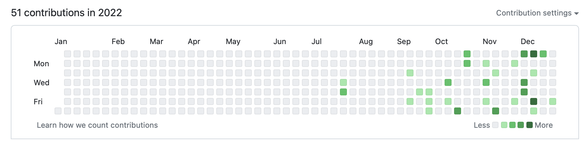
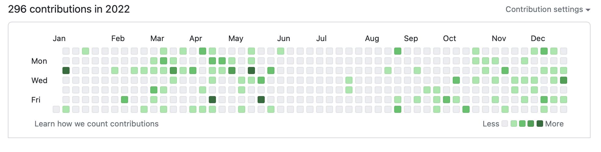

# github-reattribute
> <picture>
>   <source media="(prefers-color-scheme: light)" srcset="https://raw.githubusercontent.com/Mqxx/GitHub-Markdown/main/blockquotes/badge/light-theme/danger.svg">
>   
> </picture> 
>
> This project is in beta, I am not responsible if data is lost during the conversion.

Reattribute commit from different emails to one user/email address

If you have projects on your github that contain commits you made with another email address, this project is for you!

It allows you to standardize your work to rewrite all the old commits of your old work so that they are saved with your new email address.

## Before

## After

## And it's not all!
You can also execute any type of command on all repositories, for example : delete all `.DS_Store` files, or delete all `.pyc` files.
For this, you just have to modify the file `actions-git.sh` to add your own command. This command will be executed on each repository. (It can be very long if you have a lot of repositories)

> <picture>
>   <source media="(prefers-color-scheme: light)" srcset="https://raw.githubusercontent.com/Mqxx/GitHub-Markdown/main/blockquotes/badge/light-theme/warning.svg">
>   
> </picture> 
>
> Don't take credit for someone else's work. Only use this project to standardize your own commits!

# How to use it
1. Clone this project
2. Give your .env file the right values
3. Execute the user recuperation script with `python3 list-all-users.py`
4. Modify the file `email.list` to match with your new email address/name
5. (Optionnal) You can modify the file `actions-git.sh` to change the git command that will be executed on each repository (delete all .DS_Store files, delete all .pyc files, etc...)
6. Once your ABSOLUTELY SURE of what you are doing, execute the script `python3 reattribute.py`
7. Wait for the script to finish...
8. Wait for the script to finish...
9. Wait... (it can take a while)
10. Enjoy your new github, with all your commits under the same email address!